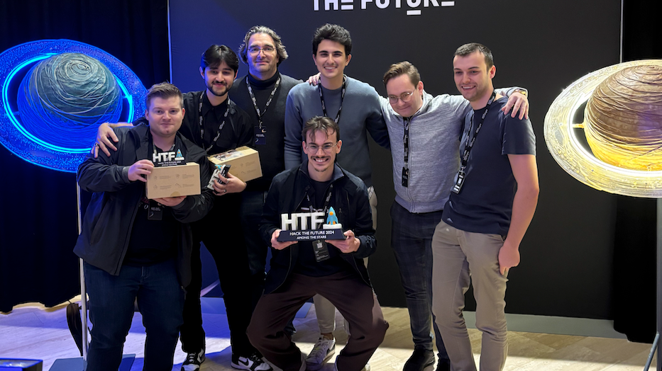

On November 19th, I had the pleasure of attending Hack the Future in Antwerp, an exhilarating day of innovation, problem-solving, and collaboration. The event, held by De Cronos Groep, brought together students to tackle real-world challenges in the tech world.
<!-- truncate -->
## The Challenge

Our team was challenged by Piros to deploy a project in an airgapped OpenShift environment. We were free to choose any project or system to deploy, which gave us the creative liberty to explore various options. After some brainstorming, we decided to build a honeypot solution with the ELK stack (Elasticsearch, Logstash, and Kibana) to monitor and analyze malicious activity to ensure nothing happens in our airgapped enviorment.

The idea was simple, deploy a honeypot to attract potential attackers and then use the ELK stack to capture and analyze any suspicious activity. However, things didn’t go entirely as planned.

## The Struggles
Setting up the ELK stack in an airgapped environment turned out to be much more challenging than we initially thought. We faced several issues with configuring and integrating the stack, and as the hours ticked by, it became clear that we wouldn’t get it working in time despite our best efforts.

In the final stretch we managed to get Cowrie up and running just in time before the end of the day. It was a massive relief to see the honeypot operational, even if we couldn’t present our initial vision with the ELK stack.

## Presentation and Judging
At the end of the event, all teams were required to present their solutions to the judges. Each presentation was an opportunity to showcase the work we’d done, explain the challenges we faced, and highlight how we overcame them. The Piros coaches, industry experts, judged the presentations based on technical complexity, creativity, and problem-solving skills.

In addition to the coaches’ votes, all participants were asked to vote for their top three teams. This made the competition even more engaging, as it added an element of peer recognition to the process.

## Public Vote Victory
While we didn’t manage to win the jury prize, something incredible happened: we won the public vote! For winning the public vote, we were awarded a really cool wooden desk lamp and a 3D-printed Hack The Future trophy.  

## Swag
As a bonus, we also received some awesome swag! Piros gifted us some Red Hat socks and the organization spoiled us with candy, a 3D-printed "4 in a row" game, and a handy power bank. Definitely a great way to wrap up an already exciting day!