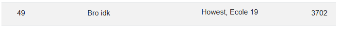
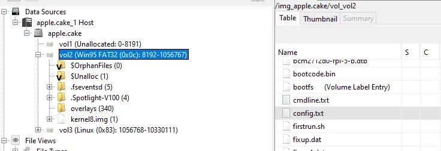
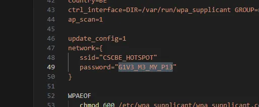

Last weekend, I teamed up with two fellow Howest students and a participant from École 19 in Wallonia, who we met through the CSCBE Discord, to take on the online qualifiers for the Cyber Security Challenge Belgium 2025.
<!-- truncate -->

With over 300 teams in the mix, the competition was tough. We tackled challenges in cryptography, forensics, web security, and reverse engineering, pushing ourselves to the limit. After a long grind and some late-night problem-solving, we ended up in 49th place. Unfortunately, that wasn’t enough to qualify for the next round, but the experience was absolutely worth it.

The best part? Working together under pressure, sharing knowledge, and getting hands-on with real-world security problems. It was a great way to learn and improve, and we picked up a ton of valuable insights along the way.

The following was one of the challenges, just to give you an idea.

## Challenge: Apple.Cake
For this challenge we were given a file called appel.cake.xz
So started off searching what a xz file was. But this is simply a compressed file like a zip or 7z. Knowing this I quickly found a tool and on linux used the command “unxz apple.cake.xz”. Now that we have a file we want to figure out what kind of file it is. For this we can simply use the command “file” which let me know it is a filesystem. I recalled a good tool called Autopsy.
The file system contained three partition. The first partion has the boot files etc while the second one has our user files. So i went to look here. The users Desktop folder contained a Raspberry Pie (rpi) manual which got me thinking. When you deploy a rpi you can set credentials and other settings in a config.txt in the boot partition.

At first glance this didn’t contain much. But I noticed a firstrun.sh script, this could be interesting. And indeed it was. It contained wifi credentials which ended up being the flag.

Even though we didn’t make it to the finals, the Cyber Security Challenge Belgium was an awesome experience. If you’re into cybersecurity, I’d highly recommend giving it a shot next year!