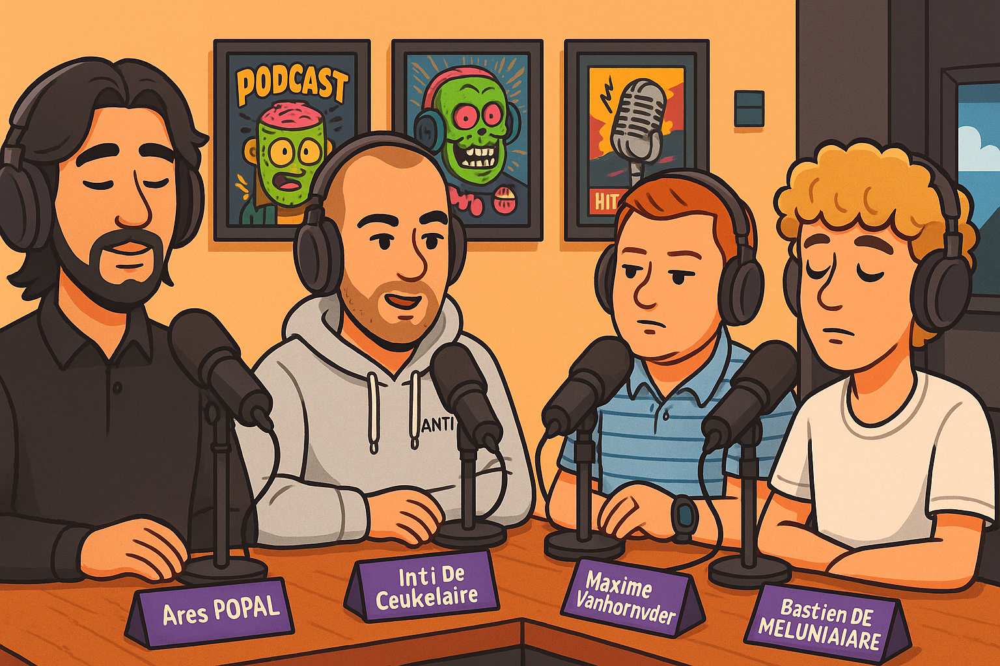

<!-- truncate -->

Recently, we had the pleasure of welcoming Inti De Ceukelaire, Head of Hackers at Intigriti, to our [Howest podcast](https://open.spotify.com/episode/5VbP8J1qM7ucCcp0IgPklR).  
➡️ Please note: the podcast episode is entirely in Dutch.  

Here’s an English summary of some key insights from our conversation with Inti.

The podcast was hosted by [Bastien De Meulenaere](https://www.linkedin.com/in/bastien-de-meulenaere), [Ares Popal](https://www.linkedin.com/in/ares-ppl) and [Maxime Vanhoorneweder](https://www.linkedin.com/in/maxime-vanhoorneweder/).

## The Role of a “Head of Hackers” and Bug Bounties

Inti explained his role at Intigriti, where he's responsible for building and maintaining Europe’s largest community of ethical hackers — around 150,000 strong.

> “Just because you have a community doesn’t mean they enjoy working with you.”

Intigriti focuses on **Bug Bounty programs**, where companies invite hackers to find vulnerabilities and reward them based on results — not hours worked.

## How It All Started

For Inti, it all began with curiosity.

> “I was just curious. How does hacking work? It can’t be black magic, right?”

That desire to *understand* hacking was the starting point of his journey.

## More Than Just Technical Skills: The Opportunist

Inti wasn't a hardcore gamer or hardware nerd. Instead, he called himself a **“tech opportunist.”**

> “I just wanted to cheat at games. Tech helped me reach my goals.”

He viewed technology as a tool — not something to obsess over, but something to leverage.

## Debunking the Introverted Hacker Myth

When Ares mentioned the stereotypical lone hacker, Inti offered a fresh perspective.

> “I can be introverted after big events, but around hackers, I’m energized.”

His background as a youth camp leader helped him develop communication and presentation skills.

> “If you want to hack systems made and used by people, you should understand people too.”

## The Power of Initiative and Seizing Opportunities

A key theme throughout the episode was **self-initiative**.

> “No one ever became an expert just by going to school and working 9-to-5.”

He urged students to:
- Attend (often free) conferences
- Start personal projects
- Try bug bounties — and embrace failure

> “Life rewards the opportunist.”

## Making Cybersecurity More Accessible

Through Instagram and TikTok, Inti is reshaping how we talk about cybersecurity.

His shows like **“Toverhacks”** and the upcoming **“Artifhacking Intelligence”** present **live hacking demos in an entertaining way**, helping to break hacker stereotypes.

> “I want to make ‘hacker’ the default. Ethical by default. Criminal hackers are a separate category.”

## 🤖 AI: A New Playground

The rise of AI is a game-changer.

> “With this AI wave, everyone is back on a level playing field.”

He’s experimenting with things like applying interrogation techniques to AI — but reminds us:

> “AI is a magnifying glass. If you're bad, AI amplifies that. It's pattern recognition — not science fiction.”

## Ethics, Legislation, and a “Criminal Record”

Inti shared his own experience with outdated laws around ethical hacking.

> “At 19, I reported a vulnerability and got prosecuted.”

That event pushed him to advocate for legal reform, contributing to Belgium’s now-progressive stance on ethical hacking — including programs like **“Hack the Government.”**

## Conclusion: A Call to Action

Inti's message to aspiring cybersecurity professionals is clear:

> Be curious. Be an opportunist (in the best sense). Take initiative. And don’t fear unconventional paths.

Cybersecurity is always evolving — and the next opportunity could be yours to grab.

[🎧 **Listen to the full episode on Spotify (in Dutch)** for even more insights from Inti De Ceukelaire.](https://open.spotify.com/episode/5VbP8J1qM7ucCcp0IgPklR)
